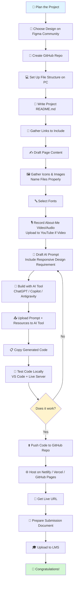

# 🚀 Build Your Student Portfolio Website — Step-by-Step Guide

A complete, beginner-friendly guide to designing, building, and hosting your own personal portfolio website using AI coding tools, Git/GitHub, and free hosting platforms.

> 💡 **New to coding?** No problem. This guide assumes zero prior experience with Git, hosting, or AI coding tools. Every tool below has a link to download/sign up and a tutorial to learn it.

---

## 📋 Table of Contents

1. [What You'll Need (Tools & Accounts)](#1-what-youll-need-tools--accounts)
2. [Project Workflow Diagram](#2-project-workflow-diagram)
3. [Step-by-Step Walkthrough](#3-step-by-step-walkthrough)
4. [Recommended AI Tools Comparison](#4-recommended-ai-tools-comparison)
5. [Free Hosting Options Comparison](#5-free-hosting-options-comparison)
6. [Submission Checklist](#6-submission-checklist)
7. [Extra Resources & Cheat Sheets](#7-extra-resources--cheat-sheets)

---

## 1. What You'll Need (Tools & Accounts)

Set these up **before** you start building. Click each link to download or sign up — most are completely free.

### Core Accounts

| Tool | Purpose | Link |
|---|---|---|
| **GitHub** | Hosts your code & project repo | [Sign up at github.com](https://github.com/join) |
| **Figma** | Pick/design your website layout | [Sign up at figma.com](https://www.figma.com/signup) |
| **Netlify** | Free website hosting | [Sign up at netlify.com](https://app.netlify.com/signup) |
| **Vercel** | Free website hosting (alternative) | [Sign up at vercel.com](https://vercel.com/signup) |

### Software to Install

| Tool | Purpose | Download Link |
|---|---|---|
| **Git** | Version control (required for GitHub) | [git-scm.com/downloads](https://git-scm.com/downloads) |
| **VS Code** | Code editor | [code.visualstudio.com](https://code.visualstudio.com/download) |
| **GitHub Desktop** *(optional, easier for beginners)* | Visual Git tool — no command line needed | [desktop.github.com](https://desktop.github.com/) |

### VS Code Extensions (install after VS Code)

| Extension | Purpose | Link |
|---|---|---|
| **Prettier** | Auto-formats your code so it looks clean | [Install Prettier](https://marketplace.visualstudio.com/items?itemName=esbenp.prettier-vscode) |
| **Live Server** | Lets you preview your HTML site in the browser instantly | [Install Live Server](https://marketplace.visualstudio.com/items?itemName=ritwickdey.LiveServer) |

> 📺 How to install a VS Code extension (if you've never done it): [VS Code Extensions Guide](https://code.visualstudio.com/docs/editor/extension-marketplace)

### AI Tools (Pick One or Try a Few)

| Tool | Purpose | Link |
|---|---|---|
| **ChatGPT** | Generate your HTML/CSS/JS code from a prompt | [chat.openai.com](https://chat.openai.com/) |
| **GitHub Copilot** | AI pair-programmer inside VS Code (autocompletes & writes code as you type) | [github.com/features/copilot](https://github.com/features/copilot) |
| **Google Antigravity** | Free agentic AI coding IDE — describe what you want, it builds, tests, and even previews it in a browser for you | [antigravity.google](https://antigravity.google/) |

> See the [full comparison table](#4-recommended-ai-tools-comparison) below to help you choose.

### 📚 Free Structured Courses (Udacity)

If you'd rather learn the fundamentals properly before relying on AI tools, Udacity offers these completely free, self-paced courses:

| Course | Covers | Link |
|---|---|---|
| **Intro to HTML and CSS** | HTML tags, CSS syntax/selectors, code editors, DevTools | [udacity.com/course/ud001](https://www.udacity.com/course/intro-to-html-and-css--ud001) |
| **Web Development Fundamentals** | HTML/CSS best practices, Flexbox, CSS Grid, responsive layouts | [udacity.com/course/cd0427](https://www.udacity.com/course/web-development-fundamentals--cd0427) |
| **JavaScript Basics** | Variables, conditionals, loops, functions, arrays — build an interactive résumé | [udacity.com/course/cd2073](https://www.udacity.com/course/intro-to-javascript--cd2073) |
| **Version Control with Git** | Git fundamentals — repos, commits, branching, merging | [udacity.com/course/ud123](https://www.udacity.com/course/version-control-with-git--ud123) |
| **How to Use Git and GitHub** | Git + GitHub together — remotes, pushing/pulling, pull requests | [udacity.com/course/ud775](https://www.udacity.com/course/how-to-use-git-and-github--ud775) |

> 💡 No sign-up cost — just create a free Udacity account to access the lessons.

### 🎥 Quick YouTube Tutorials

If you prefer fast, video-based learning over a structured course, these are solid, beginner-friendly picks:

| Topic | Video | Link |
|---|---|---|
| HTML & CSS | freeCodeCamp's HTML/CSS tutorials (channel) | [Watch on YouTube](https://www.youtube.com/@freecodecamp) |
| Git & GitHub | "Git and GitHub for Beginners – Crash Course" (freeCodeCamp) | [Watch on YouTube](https://www.youtube.com/watch?v=RGOj5yH7evk) |
| Figma Basics | "Figma for Beginners" (Official Figma playlist) | [Watch on YouTube](https://www.youtube.com/playlist?list=PLXDU_eVOJTx7QHLShNqIXL1Cgbxj7HlN4) |
| Deploying to Netlify | "How to Deploy a Website on Netlify" | [Watch on YouTube](https://www.youtube.com/watch?v=0P53S34zm44) |

> 📌 These links are added throughout the relevant steps below too, so you don't have to scroll back up.

---

## 2. Project Workflow Diagram



> 💡 **Tip:** If your code doesn't work the first time (step O → P), that's normal! Go back to your prompt, describe the bug to your AI tool, and try again. This loop is part of the process.

---

## 3. Step-by-Step Walkthrough

### Step 1: Create a GitHub Repository
This is where your project's code will live online.
- Log in to GitHub → click **New repository**
- Name it something like `your-name-portfolio`
- Check "Add a README file"
- 📺 Tutorial: [Creating a repo on GitHub](https://docs.github.com/en/repositories/creating-and-managing-repositories/creating-a-new-repository)
- 🎓 New to Git/GitHub entirely? Start with Udacity's free [Version Control with Git](https://www.udacity.com/course/version-control-with-git--ud123) course, then [How to Use Git and GitHub](https://www.udacity.com/course/how-to-use-git-and-github--ud775)
- 🎥 Or watch the [Git and GitHub for Beginners – Crash Course (freeCodeCamp)](https://www.youtube.com/watch?v=RGOj5yH7evk) on YouTube

### Step 2: Create Your File Structure on Your PC
A clean structure makes your project easy to manage. Example:
```
your-name-portfolio/
├── index.html
├── about.html
├── projects.html
├── contact.html
├── /css
│   └── style.css
├── /js
│   └── script.js
├── /images
│   └── (your icons & photos)
└── README.md
```

### Step 3: Write Your Project README.md
This file explains your project to anyone who visits your repo. Include: project title, description, technologies used, and the live link (you'll add this later).
- 📺 Guide: [About READMEs (GitHub Docs)](https://docs.github.com/en/repositories/managing-your-repositorys-settings-and-features/customizing-your-repository/about-readmes)
- 🛠️ Helpful tool: [Markdown Cheat Sheet](https://www.markdownguide.org/cheat-sheet/)

### Step 4: Choose a Design from Figma Community
Browse free, ready-made portfolio templates you can reference for layout and style.
- 🔗 [Figma Community — Portfolio Templates](https://www.figma.com/community)
- 📺 Tutorial: [How to use Figma Community files](https://help.figma.com/hc/en-us/articles/360039825054-Use-files-from-the-Community)
- 🎥 Brand new to Figma? Watch the official [Figma for Beginners playlist (Figma's YouTube channel)](https://www.youtube.com/playlist?list=PLXDU_eVOJTx7QHLShNqIXL1Cgbxj7HlN4)
- You don't need to design from scratch — duplicate a template and explore it ("inspect mode" shows you colors, fonts, and spacing).

### Step 5: Gather Links to Include
Collect URLs you'll need on your site: your GitHub, LinkedIn, email, social media, resume (Google Drive or PDF link), and any project demo links.

### Step 6: Draft Your Page Content
Write the actual text that will appear on each page — your bio, project descriptions, skills list, etc. Doing this *before* building saves a lot of back-and-forth with the AI tool later.

### Step 7: Gather Icons & Images
- Free icons: [Font Awesome](https://fontawesome.com/), [Flaticon](https://www.flaticon.com/), [Heroicons](https://heroicons.com/)
- Free images: [Unsplash](https://unsplash.com/), [Pexels](https://www.pexels.com/)
- **Name your files properly** — e.g. `profile-photo.jpg`, `github-icon.svg`, `project1-screenshot.png` — not `IMG_4821.jpg`. This keeps your code readable and makes it far easier for the AI tool to reference the right file.

### Step 8: Select Your Fonts
Pick 1–2 fonts (one for headings, one for body text) from a free source:
- [Google Fonts](https://fonts.google.com/)
- 📺 [How to use Google Fonts in HTML/CSS](https://developers.google.com/fonts/docs/getting_started)

### Step 9: Record Your "About Me" Video or Audio
- Keep it short (30–90 seconds): who you are, what you do, what you're learning.
- **Video** → upload to YouTube (set visibility to "Unlisted" if you don't want it public) → embed the link on your About page.
  - 📺 [How to upload a video to YouTube](https://support.google.com/youtube/answer/57407)
- **Audio** → you can host it free on platforms like [SoundCloud](https://soundcloud.com/) and embed the player.

### Step 10: Draft the Prompt to Build the Project
This is the most important step — a clear prompt = better AI output. Your prompt should include:
- Page structure (home, about, projects, contact)
- Design direction (colors, fonts, style — reference your Figma file)
- **Responsiveness requirement** — explicitly ask for mobile, tablet, and desktop layouts
- Content placeholders for your text, image file names, and links

> 🎓 Want to understand *why* the generated code works (not just copy-paste it)? Udacity's free [Intro to HTML and CSS](https://www.udacity.com/course/intro-to-html-and-css--ud001) and [Web Development Fundamentals](https://www.udacity.com/course/web-development-fundamentals--cd0427) courses cover exactly this, including responsive layouts with Flexbox/Grid.
> 🎥 Prefer video? [HTML & CSS Full Course – Beginner to Pro (freeCodeCamp)](https://www.youtube.com/c/Freecodecamp) covers the same fundamentals.

**Example prompt structure:**
```
Build a responsive personal portfolio website using HTML, CSS, and JavaScript.

Pages needed: Home, About, Projects, Contact
Design style: [describe — e.g. minimalist, dark mode, colorful]
Fonts: [your chosen Google Font names]
Make sure the layout is fully responsive (mobile, tablet, desktop) using
flexbox/grid and media queries.

Here is my content for each page: [paste your drafted content]
Here are my image/icon file names to reference: [list them]
```

### Step 11: Start Building with Your AI Tool of Choice
Use ChatGPT, GitHub Copilot, or Antigravity (see [comparison table](#4-recommended-ai-tools-comparison)) and paste in your prompt.

> 🎓 If your AI tool adds JavaScript interactivity (e.g. a contact form, a nav menu toggle) and you want to understand what it generated, Udacity's free [JavaScript Basics](https://www.udacity.com/course/intro-to-javascript--cd2073) course is a great companion — you'll even build an interactive résumé as practice.

### Step 12: Upload Your Prompt and Resources
If your AI tool supports file uploads (ChatGPT and Antigravity both do), upload your images, icons, and any reference design files so the AI can use the real assets.

### Step 13: Copy and Paste the Solution
Copy the generated HTML/CSS/JS code into the matching files in your project folder.

### Step 14: Test Your Code
Open your project folder in VS Code, right-click `index.html` → **Open with Live Server**.
- 📺 [Live Server extension usage guide](https://marketplace.visualstudio.com/items?itemName=ritwickdey.LiveServer)
- Test on different screen sizes using Chrome DevTools: press `F12` → click the device toolbar icon.
- 📺 [How to test responsive design in Chrome DevTools](https://developer.chrome.com/docs/devtools/device-mode)

### Step 15: Upload Your Project to the Repository
Using GitHub Desktop (recommended for beginners) or Git commands:
```bash
git add .
git commit -m "Initial portfolio build"
git push origin main
```
- 📺 [GitHub Desktop guide](https://docs.github.com/en/desktop/overview/getting-started-with-github-desktop)
- 📺 [Git basics for absolute beginners](https://docs.github.com/en/get-started/start-your-journey/hello-world)

### Step 16: Host Your Project and Get a URL
Pick **one** of these free hosts (see full comparison in [Section 5](#5-free-hosting-options-comparison)):
- **Netlify** → [app.netlify.com](https://app.netlify.com/) — drag-and-drop your folder, or connect your GitHub repo for auto-deploys. [Netlify deploy guide](https://docs.netlify.com/site-deploys/create-deploys/)
  - 🎥 [How to Deploy a Website on Netlify (YouTube)](https://www.youtube.com/watch?v=0P53S34zm44)
- **Vercel** → [vercel.com](https://vercel.com/) — import your GitHub repo directly. [Vercel deploy guide](https://vercel.com/docs/deployments/overview)
- **GitHub Pages** → free hosting straight from your repo settings. [GitHub Pages quickstart](https://docs.github.com/en/pages/quickstart)

You'll get a live link like `your-project.netlify.app` or `yourname.github.io/repo-name`.

### Step 17: Prepare Your Submission Document
Include: project title, your live URL, your GitHub repo link, screenshots, and a short reflection on what you learned/struggled with.

### Step 18: Upload to LMS
Submit your document following your course's submission instructions.

### 🎉 Congratulations — you've shipped a real, live website!

---

## 4. Recommended AI Tools Comparison

| Tool | Best For | Cost | Link |
|---|---|---|---|
| **ChatGPT** | Generating full HTML/CSS/JS from a single detailed prompt; great for beginners who want to copy-paste | Free tier available | [chat.openai.com](https://chat.openai.com/) |
| **GitHub Copilot** | Autocompleting code line-by-line as you type inside VS Code; great once you have *some* code already started | Free tier (limited); free for verified students when sign-ups are open — [check eligibility](https://github.com/settings/education/benefits) | [github.com/features/copilot](https://github.com/features/copilot) |
| **Google Antigravity** | Describing your whole project in natural language and letting an AI agent build, preview, and fix it in a built-in browser — great for beginners who want a more "hands-off" build | Free during public preview | [antigravity.google](https://antigravity.google/) |

> ⚠️ **Note:** Free tiers and sign-up availability for AI tools change frequently. Always check the official link above for the current offer before you start.

📺 Helpful tutorials:
- [ChatGPT for beginners (OpenAI Help Center)](https://help.openai.com/en/articles/6783457-chatgpt-101)
- [Getting started with GitHub Copilot](https://docs.github.com/en/copilot/get-started/quickstart)
- [Getting started with Google Antigravity (Codelab)](https://codelabs.developers.google.com/getting-started-google-antigravity)

---

## 5. Free Hosting Options Comparison

| Platform | Setup Difficulty | Auto-Deploy from GitHub? | Custom Domain Support | Link |
|---|---|---|---|---|
| **Netlify** | ⭐ Easiest (drag & drop) | ✅ Yes | ✅ Free | [netlify.com](https://www.netlify.com/) |
| **Vercel** | ⭐⭐ Easy | ✅ Yes | ✅ Free | [vercel.com](https://vercel.com/) |
| **GitHub Pages** | ⭐⭐ Easy (built into GitHub) | ✅ Yes (via Actions) | ✅ Free | [pages.github.com](https://pages.github.com/) |

All three are completely free for static sites (HTML/CSS/JS) like the portfolio you're building. Pick whichever feels most comfortable — Netlify is generally the fastest to get a link from for total beginners.

---

## 6. Submission Checklist

Before you submit, confirm you have:

- [ ] GitHub repo created and code pushed
- [ ] README.md written with project description
- [ ] All pages built (Home, About, Projects, Contact)
- [ ] Site is responsive (tested on mobile + desktop)
- [ ] About Me video/audio embedded
- [ ] Icons and images properly named and displaying correctly
- [ ] Site hosted and live URL works
- [ ] Submission document prepared with all links and screenshots
- [ ] Document uploaded to LMS

---

## 7. Extra Resources & Cheat Sheets

| Resource | What It's For | Link |
|---|---|---|
| MDN Web Docs | The best free HTML/CSS/JS reference | [developer.mozilla.org](https://developer.mozilla.org/) |
| freeCodeCamp | Free structured HTML/CSS/JS course | [freecodecamp.org](https://www.freecodecamp.org/) |
| Udacity Free Courses | Browse all of Udacity's free, self-paced web dev courses in one place | [udacity.com/courses/all](https://www.udacity.com/courses/all?price=free) |
| Git Cheat Sheet | Quick reference for Git commands | [GitHub Education Git Cheat Sheet](https://education.github.com/git-cheat-sheet-education.pdf) |
| Can I Use | Check browser support for CSS/JS features | [caniuse.com](https://caniuse.com/) |
| Google Fonts | Free fonts for your site | [fonts.google.com](https://fonts.google.com/) |
| Markdown Guide | Reference for writing your README | [markdownguide.org](https://www.markdownguide.org/) |

---

*Made for coursemates learning to build their first portfolio website. Fork this guide, adapt it, and pass it on. 🙌*
